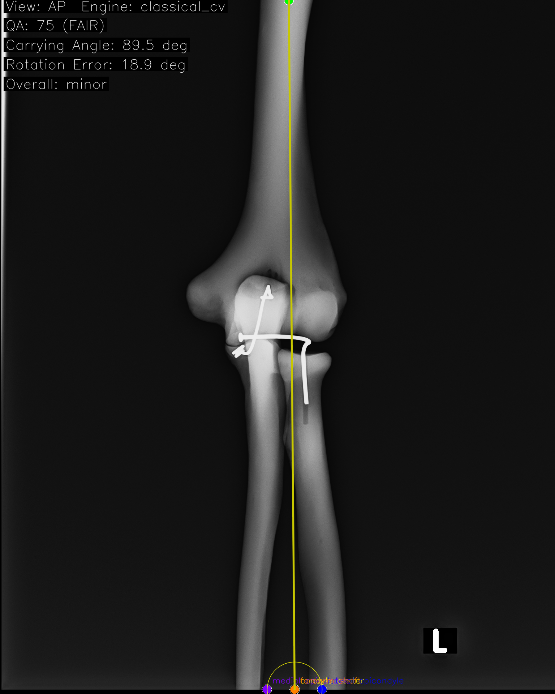
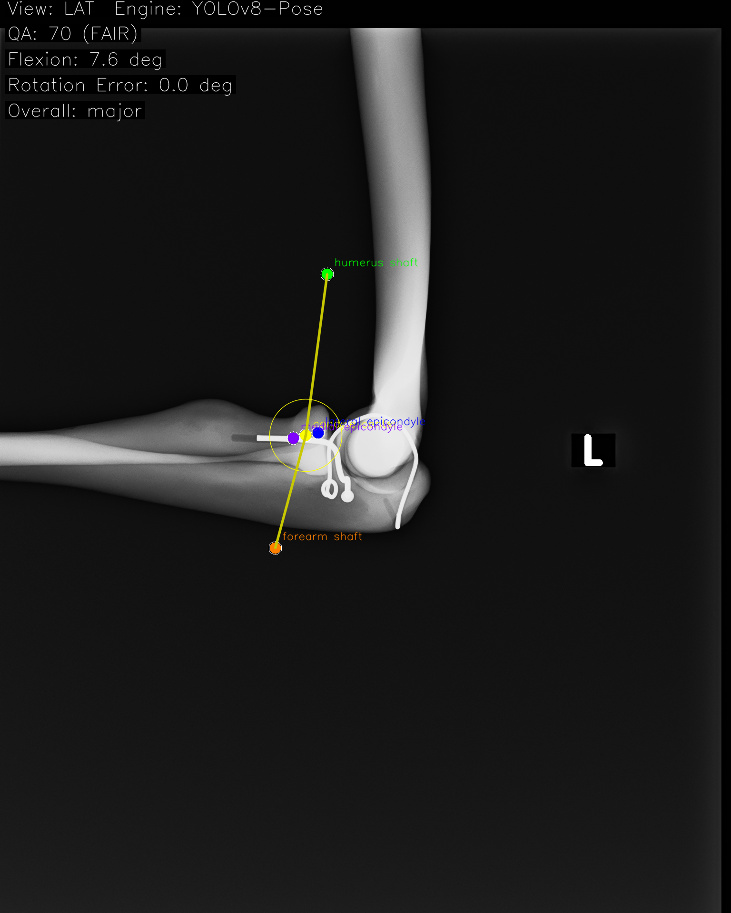
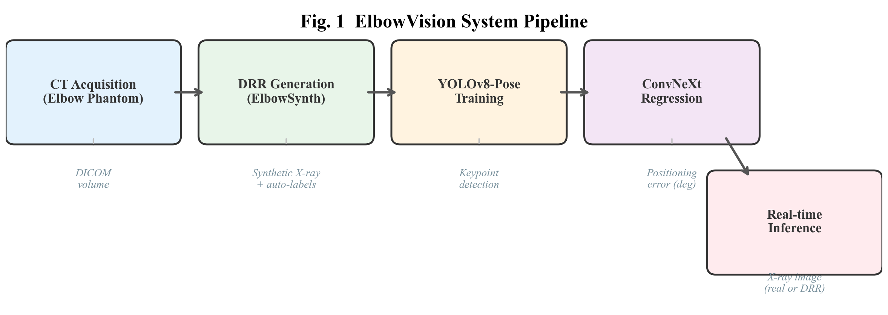
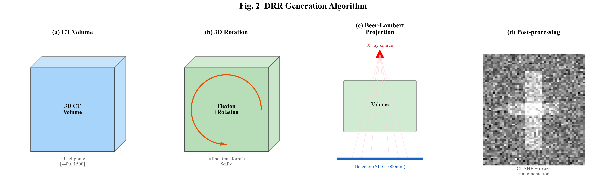
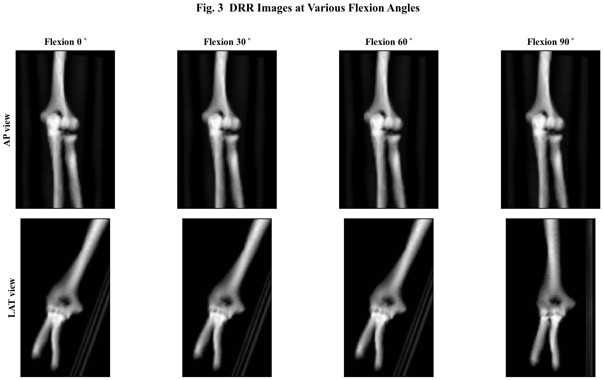
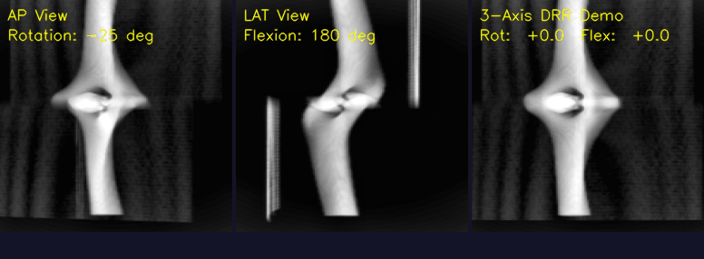

<!-- _class: lead -->

# ElbowVision

## AIで肘X線の撮影品質を自動評価する

---

# 今日話すこと

1. **何をやっているか** — 肘X線 + AI
2. **なぜやるのか** — 撮影品質の課題
3. **どうやるか** — CTから合成X線を作って学習
4. **デモ** — 実際の推論結果

---

# 肘X線撮影の「あるある」

- 側面像: *内外側上顆がきれいに重なる*のが理想
- でも実際は...
  - ちょっと回旋がズレる
  - 屈曲角度が合わない
  - 撮り直し → **患者さんの被曝が増える**

**経験の浅い技師ほど判断に迷う**

→ AIが「ここズレてるよ」と教えてくれたら？

---

# ElbowVisionのコンセプト

<div class="columns">
<div>

### X線画像をアップロードするだけ

1. AIがキーポイントを自動検出
2. 角度を計算
3. ポジショニングの品質を判定
4. **修正方向をアドバイス**

「もう少し内旋して」
「屈曲が足りません」

</div>
<div>



</div>
</div>

---

# 実際の推論結果

<div class="columns">
<div>

### AP像（正面）


Carrying Angle: 3.0deg
QA: 95 (GOOD)

</div>
<div>

### LAT像（側面）


Flexion: 7.6deg
QA: 70 (FAIR)

</div>
</div>

---

# でも...AIの学習データどうする？

普通のAI開発:
> 大量の画像を集めて、人間が1枚ずつアノテーション...

**問題:**
- 肘X線を何千枚も集めるのは大変
- 1枚ずつキーポイントを手打ち？ 気が遠くなる
- 倫理委員会の審査も必要

→ **別のアプローチが必要**

---

# 解決策: CTからX線を「作る」



**DRR (Digitally Reconstructed Radiograph)** = CTから計算で作る合成X線

---

# DRRって何？

<div class="columns">
<div>

### CTは3Dボリュームデータ
- 各ボクセルにCT値（HU）がある
- X線の透過をシミュレーションできる

### Beer-Lambert法則
- 骨（高HU）→ よく吸収 = 白く写る
- 軟部組織（低HU）→ 透過 = 黒く写る

*CTがあれば、任意の角度からX線画像を再現できる*

</div>
<div>



</div>
</div>

---

# 角度を変えると...



**3Dで回転させて2Dに投影** → いろんなポジショニングの画像が自動生成される

---

# このアプローチの何がすごいか

| 従来のやり方 | ElbowVisionのやり方 |
|---|---|
| 実X線を大量に集める | CTから**自動生成** |
| 人間がアノテーション | **ラベルも自動計算** |
| 倫理委員会必須 | ファントムCTなら**不要** |
| 数百枚が限界 | **何千枚でも生成可能** |
| 角度の正解がわからない | CT座標から**真値が計算できる** |

→ *アノテーションコスト: ゼロ*

---

# 使っている技術

| コンポーネント | 技術 | 役割 |
|---|---|---|
| キーポイント検出 | **YOLOv8-Pose** | 骨の6ランドマークを検出 |
| 角度回帰 | **ConvNeXt** | ポジショニングエラーを直接予測 |
| バックエンド | **FastAPI** | 画像受付・推論API |
| フロントエンド | **Next.js** | ブラウザUI |
| 精度検証 | **Bland-Altman法** | CT真値との一致性評価 |

---

# 研究のロードマップ

```
Phase 1: ファントム検証 ← 今ここ
  ├─ 骨等価樹脂ファントムのCTを使用
  ├─ 倫理委員会不要ですぐ始められる
  └─ 「AIで検出できる」ことの実証

Phase 2: 患者データ検証（次のステップ）
  ├─ 実際の患者CTを使用
  ├─ 倫理委員会承認が必要
  └─ 臨床的な精度を検証

Phase 3: 臨床応用
  ├─ 撮影室でリアルタイムフィードバック
  └─ 教育・品質管理ツールとして展開
```

---

# まとめ

- **CTからX線を合成**して、アノテーション不要でAIを学習
- **ポジショニングの品質を自動判定**し、修正方向をアドバイス
- ファントムで実証中 → 患者データ → 臨床応用へ

### 放射線技師 x AI の可能性

*「撮り直しを減らす」= 患者の被曝を減らす*
*「経験を数値化する」= 教育ツールになる*

---

# DRR生成デモ: CTから肘X線が作られる様子

<div style="text-align: center;">



</div>

前腕の回旋角度を -30° ~ +30° で変化させたDRR
*1つのCTから、無数のポジショニングバリエーションを生成できる*

---
